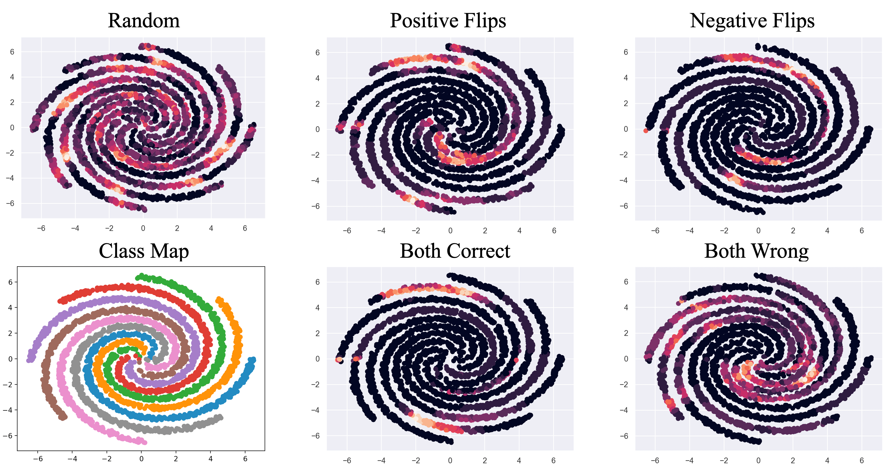

# RoSE
Official code repository for *Targeting Negative Flips in Active Learning using Validation Set* paper presented at IEEE International Conference on Big Data 2024, Washington DC, USA.

Work conducted at [OLIVES@GaTech](https://alregib.ece.gatech.edu). Arxiv paper available at [https://arxiv.org/pdf/2405.13758](https://arxiv.org/pdf/2405.13758).


Negative flips on the 2D artificial spiral dataset. Active learning is performed with random sampling with and without restricting the unlabeled sampling pool. Each plot except the class map represents a different subset restriction. The plot labeled Random has no restriction.

**Abstract**: The performance of active learning algorithms can be improved in two ways. The often used and intuitive way is by reducing the overall error rate within the test set. The second way is to ensure that correct predictions are not forgotten when the training set is increased in between rounds. The former is measured by the accuracy of the model and the latter is captured in negative flips between rounds. Negative flips are samples that are correctly predicted when trained with the previous/smaller dataset and incorrectly predicted after additional samples are labeled. In this paper, we discuss improving the performance of active learning algorithms both in terms of prediction accuracy and negative flips. The first observation we make in this paper is that negative flips and overall error rates are decoupled and reducing one does not necessarily imply that the other is reduced. Our observation is important as current active learning algorithms do not consider negative flips directly and implicitly assume the opposite. The second observation is that performing targeted active learning on subsets of the unlabeled pool has a significant impact on the behavior of the active learning algorithm and influences both negative flips and prediction accuracy. We then develop \texttt{ROSE} - a plug-in algorithm that utilizes a small labeled validation set to restrict arbitrary active learning acquisition functions to negative flips within the unlabeled pool. We show that integrating a validation set results in a significant performance boost in terms of accuracy, negative flip rate reduction, or both.

Also contains code for segmentation and classification.

## Installation
First, install poetry (you may need to update pip first):
```
pip install -U pip
pip install poetry
```

Second, run the installation process:

```poetry install```

This should install all necessary packages and dependecies. If you want to add dependencies, add them in the pyproject.toml file in the same fashion.
